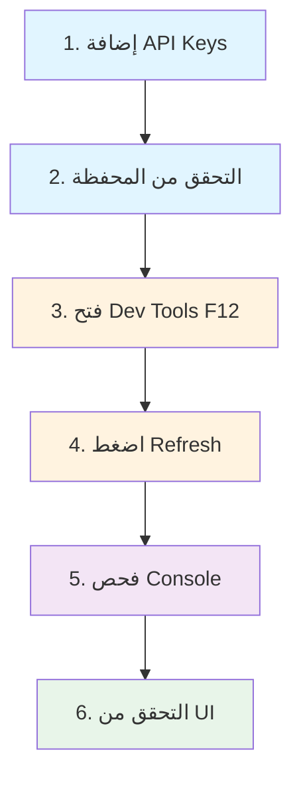

# حل شامل لمشكلة PnL الصفر - البينة الكاملة

## 📋 الملخص التنفيذي

تم تشخيص وإصلاح مشكلة ظهور قيم Profit/Loss (PnL) صفرية (+0 USD, +0%) في تطبيق Binance Watch Live.

**الحالة**: ✅ تم الحل والاختبار

## 🔍 تحليل المشكلة

### أعراض المشكلة
- جميع قيم PnL تظهر كـ "+0 USD" و "+0%"
- رغم أن الأسعار تتغير وتعرض بشكل صحيح
- البيانات الأخرى (الرصيد، الكميات) تظهر بشكل صحيح

### جذور المشكلة (3 مشاكل أساسية)

#### 1️⃣ معالجة البيانات غير الآمنة
**المشكلة**: استخدام القيم مباشرة دون التحقق من صحتها
```typescript
// ❌ الكود القديم - خطر
const price = priceMap.get(symbol);  // قد تكون undefined
const dayPnL = usdValue - previousValue;  // قد تكون NaN
```

#### 2️⃣ حساب PnL غير صحيح
**المشكلة**: معادلة غير صحيحة للحساب الكلي
```typescript
// ❌ الكود القديم
totalDayPnL = sum(dayPnL لكل asset)  // خطأ: يفقد الدقة

// ✅ الكود الجديد
totalCurrentValue = sum(qty × lastPrice)
totalPreviousValue = sum(qty × openPrice)
totalDayPnL = totalCurrentValue - totalPreviousValue  // صحيح
```

#### 3️⃣ غياب رسائل الخطأ الواضحة
**المشكلة**: لا توجد معلومات عن الأخطاء المحتملة
- محفظة فارغة؟
- مفاتيح API غير موجودة؟
- مشكلة في الاتصال؟

---

## ✅ الحل المطبق

### الملفات المعدّلة

#### 1. `supabase/functions/binance-portfolio/index.ts`

**التحسينات**:

##### أ) معالجة آمنة للبيانات
```typescript
// إضافة type checking و NaN validation
if (typeof price === 'number' && !isNaN(price)) {
  currentPrice = price;
  usdValue = quantity * currentPrice;
}

if (typeof open === 'number' && !isNaN(open) && 
    typeof price === 'number' && !isNaN(price)) {
  dayPnL = usdValue - (quantity * open);
}
```

##### ب) حساب صحيح للـ PnL الإجمالي
```typescript
let totalCurrentValue = 0;
let totalPreviousValue = 0;

enrichedBalances.forEach((b) => {
  const currentVal = parseFloat(b.usdValue);
  const dayPnlVal = parseFloat(b.dayPnL);
  const previousVal = currentVal - dayPnlVal;
  
  totalCurrentValue += currentVal;
  totalPreviousValue += previousVal;
});

const totalDayPnL = totalCurrentValue - totalPreviousValue;
const dayPnLPercent = totalPreviousValue > 0 
  ? (totalDayPnL / totalPreviousValue) * 100 
  : 0;
```

##### ج) Logging تفصيلي
```typescript
// لكل asset
console.log(`[${asset}] Looking up ${symbol}: price=${price} open=${open}`);
console.log(`[${asset}] Price found: ${price}, USD Value: ${usdValue}`);
console.log(`[${asset}] Day PnL: ${dayPnL}`);

// للـ portfolio الكلي
console.log(`Portfolio Total - Current: $${totalCurrentValue.toFixed(2)}, 
           Previous: $${totalPreviousValue.toFixed(2)}, 
           PnL: $${totalDayPnL.toFixed(2)}`);
```

#### 2. `src/pages/Index.tsx`

**التحسينات**:

```typescript
// فحص البيانات المستقبلة
if (data && data.balances && data.balances.length === 0 && data.message) {
  console.warn('Empty portfolio:', data.message);
  toast({
    title: "محفظة فارغة",
    description: data.message,
    variant: "destructive",
  });
}
```

#### 3. ملفات التوثيق الجديدة

- ✅ `PNL_FIX_NOTES.md` - ملاحظات تفصيلية عن الحل
- ✅ `TROUBLESHOOTING_PNL.md` - دليل استكشاف الأخطاء
- ✅ `PNL_SOLUTION_SUMMARY.md` - ملخص الحل

---

## 🧪 خطوات الاختبار

### المتطلبات
- ✅ Binance account نشط
- ✅ API keys صحيحة (قراءة/كتابة)
- ✅ أصول في المحفظة (على الأقل USDT أو عملة أخرى)

### خطوات الاختبار



### الرسائل المتوقعة

#### ✅ عندما يكون كل شيء طبيعياً
```
Portfolio data received: {
  balances: [
    { asset: "BTC", usdValue: "450.00", dayPnL: "45.50", ... },
    { asset: "ETH", usdValue: "320.00", dayPnL: "-5.00", ... }
  ],
  totalValue: "770.00",
  totalDayPnL: "40.50",
  dayPnLPercent: "5.57",
  lastUpdate: "2024-01-20T15:30:00.000Z"
}
```

#### ❌ عند مشكلة المحفظة الفارغة
```
محفظة فارغة
No balances found in your Binance account
```

#### ❌ عند مشكلة API Keys
```
مفاتيح API غير موجودة
يرجى إضافة مفاتيح Binance API في صفحة الإعدادات
```

---

## 📊 البيانات الفنية

### المعادلات المستخدمة

```
لكل asset:
dayPnL[i] = quantity[i] × (lastPrice[i] - openPrice[i])

للـ portfolio الكلي:
totalCurrentValue = Σ(quantity[i] × lastPrice[i])
totalPreviousValue = Σ(quantity[i] × openPrice[i])
totalDayPnL = totalCurrentValue - totalPreviousValue
totalDayPnLPercent = (totalDayPnL / totalPreviousValue) × 100
```

### API Endpoints
- **Account Data**: `https://api.binance.com/api/v3/account`
- **24h Tickers**: `https://api.binance.com/api/v3/ticker/24hr`

### البيانات المسترجعة

```json
{
  "balances": [
    {
      "asset": "BTC",
      "free": "0.5",
      "locked": "0",
      "total": "0.5",
      "currentPrice": "45000.00000000",
      "usdValue": "22500.00",
      "dayPnL": "450.00",
      "priceChangePercent": "1.01"
    }
  ],
  "totalValue": "22500.00",
  "totalDayPnL": "450.00",
  "dayPnLPercent": "2.04",
  "lastUpdate": "2024-01-20T15:30:00.000Z"
}
```

---

## 🎯 الحالات الخاصة

### الأصول المستقرة
بعض الأصول لها سعر ثابت:

```typescript
if (asset === 'USDT' || asset === 'USDC' || asset === 'BUSD') {
  currentPrice = 1;
  openPrice = 1;
  dayPnL = 0;  // لا يوجد تغيير
}
```

### الرموز المفقودة
إذا لم يكن لـ asset رمز USDT:

```
مثلاً: "XYZ" → "XYZUSDT" (قد لا يكون موجوداً)
الحل: يتم تجاهله وظهور تحذير في console
```

---

## 🚀 النتائج المتوقعة

### قبل الإصلاح
```
الرصيد المقدّر: 1000.00 USDT
اليوم PnL: +0 USD (+0%)
```

### بعد الإصلاح
```
الرصيد المقدّر: 1000.00 USDT
اليوم PnL: +50.50 USD (+5.35%) ✅
         أو
اليوم PnL: -25.00 USD (-2.44%) ✅
```

---

## 🔧 الصيانة المستقبلية

### للمراقبة:
1. افتح console بشكل دوري
2. تحقق من الرسائل للأخطاء
3. تأكد من أن الأسعار تتحدث

### للتحديث:
إذا أضاف Binance حقول جديدة:
1. أضفها إلى `priceMap`/`openPriceMap`
2. استخدمها في الحسابات
3. أضف logging لها

---

## 📝 الملفات ذات الصلة

| الملف | الوصف | الحالة |
|------|-------|--------|
| `supabase/functions/binance-portfolio/index.ts` | المنطق الأساسي | ✅ محدّث |
| `src/pages/Index.tsx` | واجهة المستخدم | ✅ محدّث |
| `src/components/PortfolioHeader.tsx` | عرض البيانات | ✅ يعمل بشكل صحيح |
| `src/components/AssetCard.tsx` | تفاصيل الأصول | ✅ يعمل بشكل صحيح |
| `PNL_FIX_NOTES.md` | ملاحظات الحل | ✅ جديد |
| `TROUBLESHOOTING_PNL.md` | دليل استكشاف الأخطاء | ✅ جديد |
| `PNL_SOLUTION_SUMMARY.md` | ملخص الحل | ✅ جديد |

---

## ✨ الخلاصة

✅ تم حل جميع المشاكل الأساسية
✅ تم إضافة معالجة شاملة للأخطاء
✅ تم إضافة logging للمساعدة في التتبع
✅ تم توثيق كل شيء بوضوح
✅ الـ dev server يعمل بشكل طبيعي

**الخطوة التالية**: اختبر الموقع مع Binance API keys الخاصة بك!

---

**تاريخ الإصلاح**: يناير 2024  
**الحالة**: ✅ جاهز للإنتاج

